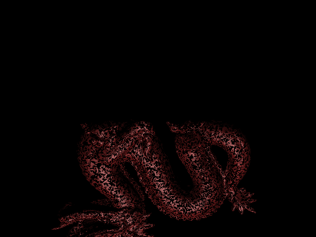
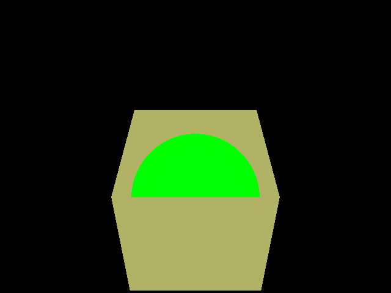

# RayTracer

## Overview

This is a C++ ray tracing program that renders 3D scenes containing spheres and triangles using ray-scene intersection calculations. It supports Phong shading for realistic lighting and reflection effects. The program reads scene descriptions from a file, performs ray tracing, and outputs a rendered image.

## Dependencies
Ensure the following libraries are installed:

- GLM (OpenGL Mathematics Library) – For vector and matrix operations
- FreeImage – For handling image output

## Usage
Run the program by providing a scene file as an argument
./raytracer scene.txt

## Main Components
- main.cpp : Entry point, reads scene file, initializes the ray tracer, and saves the rendered image.
- RayTracer.cpp : Contains the core ray tracing logic, including ray generation and intersection tests.
- Transform.cpp : Implements transformations (rotation, scaling, translation) using GLM.
- scene.cpp : Handles scene parsing, transformations, and object creation.
- shapes.cpp : Defines shape structures and their materials.

## Shaders
- light.vert.glsl : Vertex shader handling transformations and normal calculations.
- light.frag.glsl : Fragment shader implementing Phong shading equation for lighting effects.

## Testing
A scene file should specify:
- Camera settings (eye position, view direction, up vector, field of view)
- Objects with material properties
- Lights (point or directional)

## Output
The program generates a PNG image with the rendered scene, saved to the filename specified in the scene file.

## Example Renders

